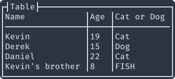

# VTUI

A basic terminal UI system for the V programing language.



Styled after [bpytop](https://github.com/aristocratos/bpytop).

:warning: This is a small hobby project. Master will be updated without warning.

## What about `term.ui`?
Oh yeah. So after I had already started this project, I found out that the built-in `term` module already included some tools for making interactive UIs in a terminal. It's very impressive, but it's not quite what I was looking for, so I'm still working on my version. That said, term.ui is way more complete and usable then my solution. If you want to check it out, you can find its docs [here](https://modules.vlang.io/term.ui.html).

<!-- TODO: Lay out the actual differences between the two modules. -->

## How do I install it?
Theoretically, these commands should automatically install and update this module
```bash
v install charliemikels.vtui
```

or
```bash
vpkg get github.com/charliemikels/vtui
```

and then it should be installed to your global V modules directory. You can then update it with.
```bash
v update
```

If you want to do it manually, just clone this repo to `~/.vmodules/charliemikels/vtui` (or wherever your V modules are stored) and you should have the same experience.

## How do I use vtui?
```v
import charliemikels.vtui

// The rest of your code here...
```

<!-- TODO: provide a more thorough mini example. -->

See the example directory for the code in action.
